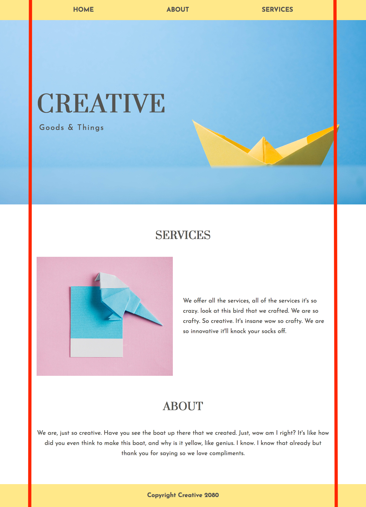

# Advanced Layouts

- [bootcamp-note](https://github.com/HackerYou/bootcamp-notes/blob/master/css/advanced-layouts.md)

## Lesson

- Don't be afraid of using `<div>` if it is used for purely presentational purpose (eg. container)
- Don't touch outline because default browser accessibility feature depends on it.
  - Only change border-color on hover if you don't want to move sibling element around.
- `max-width: 100%;` for image by default & use `width: 100%` as needed.

## Container Elements



```css
.container {
  width: 100%;
  max-width: 1200px;
  margin: 0 auto;
}
```

```html
<header>
  <div class="container">
    <nav>
      <ul>
        <li><a href="#">Home</a></li>
        <li><a href="#">About</a></li>
        <li><a href="#">Services</a></li>
      </ul>
    </nav>
    <section class="hero">
      <div class="container">...</div>
    </section>
  </div>
</header>
<main>
  <div class="container">...</div>
</main>
<footer>
  <div class="container">...</div>
</footer>
```

## CSS Variable for Gutters

Store gutter width into a variable for consistency throughout the page.

```css
:root {
  --gutter-m: 15px;
}

.article--long {
  width: calc(75% - var(--gutter-m));
  border: 1px solid olive;
  margin-right: var(--gutter-m);
}

.article--short {
  width: 25%;
  border: 1px solid palevioletred;
}
```
